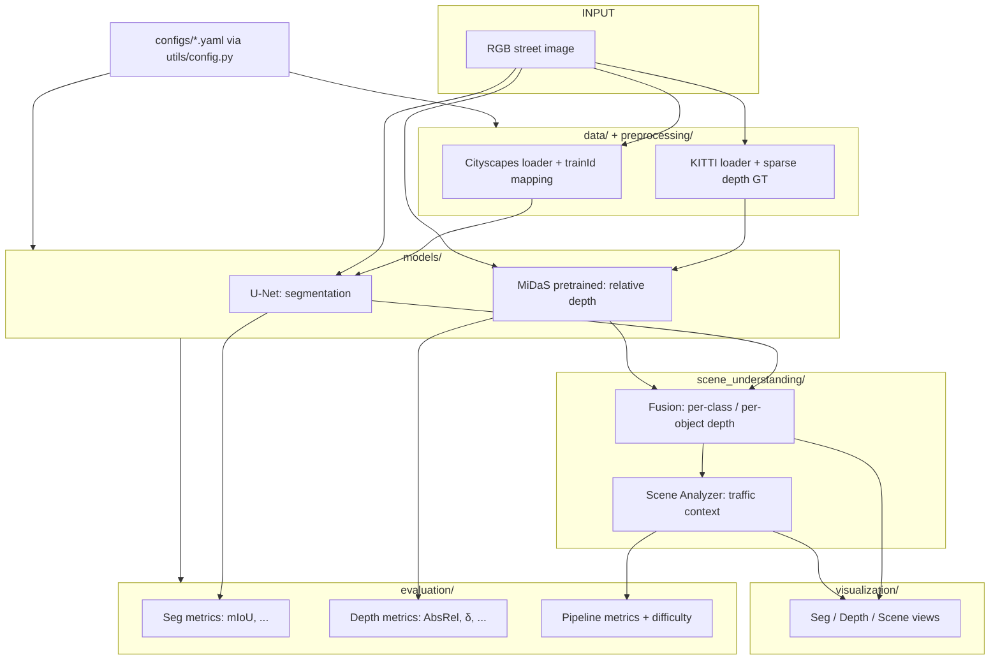
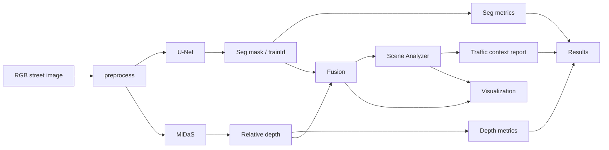
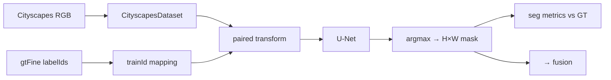
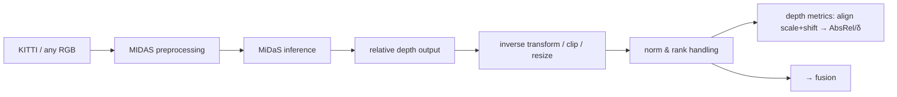
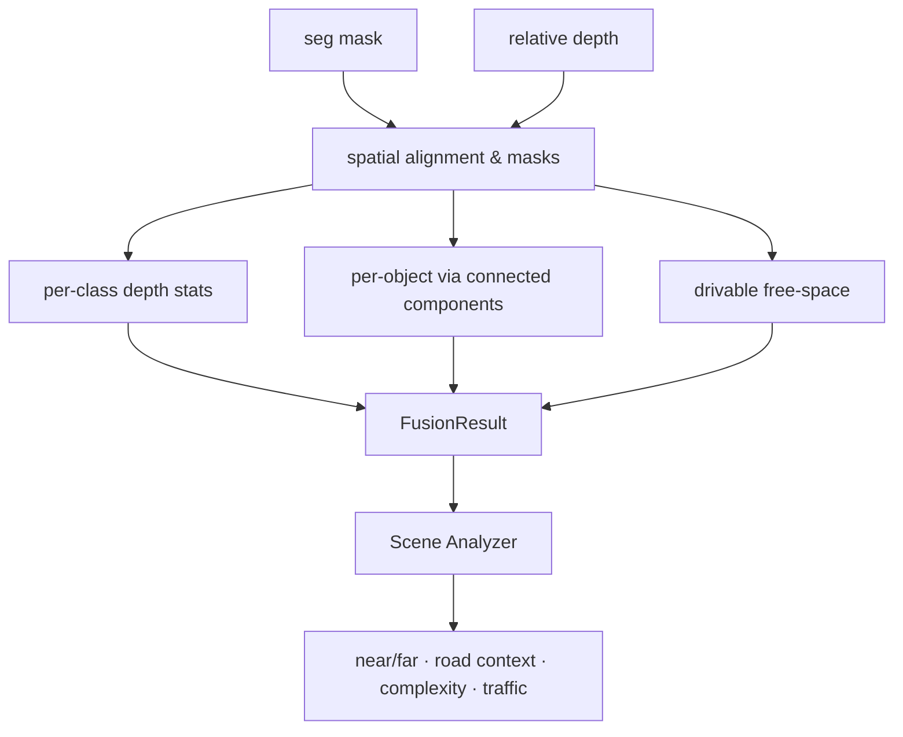
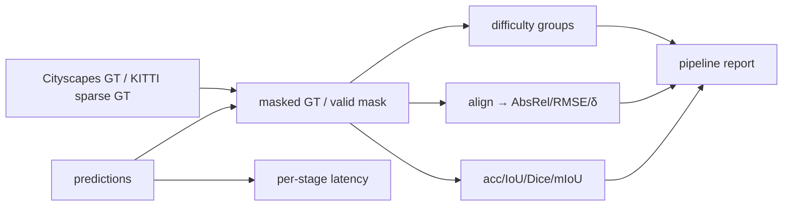
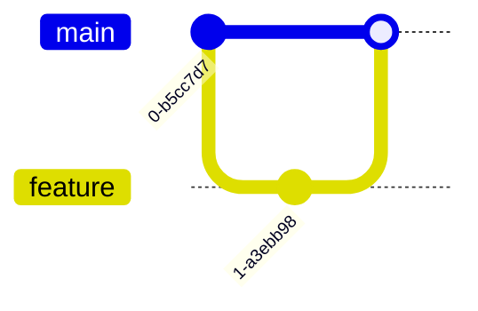
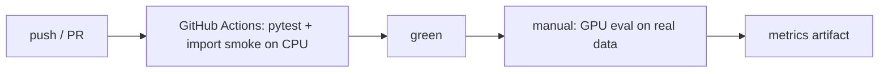

# CV-PROJECT — Architecture Specification (Step 00 Output)

> Status: **Design only — no implementation code.**
> This document is the deliverable of `prompts/00_project_architecture.md`.
> It analyzes the **existing** repository, designs the detailed architecture,
> and flags issues with recommended fixes. **No structural change is applied.**
> Another developer or AI coding agent should be able to implement the project
> step-by-step from this document without redesigning the architecture.

---

# 1. Project Overview

**Project name:** CV-PROJECT

**Goal:** Segmentation + Depth → **Scene Understanding**

| Item | Value |
|---|---|
| Input | Single RGB street-scene image |
| Output 1 | Semantic segmentation mask (pixel-wise class labels) |
| Output 2 | Monocular depth map |
| Objective | Combine both outputs into interpretable traffic/scene context analysis |
| Datasets | **Cityscapes** → semantic segmentation; **KITTI Depth** → depth estimation/evaluation |
| Models | U-Net (segmentation), MiDaS (monocular depth, pretrained) |
| Nature | University coursework; interpretable, rule-based fusion — **no learned fusion network** |

**Critical data constraint (from the prompt):** Cityscapes and KITTI are *separate*
datasets. An image from one NEVER corresponds to an image from the other. No
segmentation–depth ground truth pairs are fabricated. Fusion operates on the two
*predicted* outputs of a **single input image** at inference time only; each task
is evaluated against **its own dataset's** ground truth.

---

# 2. Functional Requirements

| ID | Requirement | Owner module |
|---|---|---|
| FR-1 | Load Cityscapes RGB images and paired fine annotations | `preprocessing/cityscapes.py` |
| FR-2 | Convert Cityscapes `labelIds` → 19-class `trainId` space with ignore pixels | `preprocessing/cityscapes.py` |
| FR-3 | Load KITTI RGB images and sparse depth ground truth (Eigen split) | `preprocessing/kitti.py` |
| FR-4 | Apply transforms; keep image and label **spatially aligned** | `preprocessing/*`, `utils/config.py` |
| FR-5 | Split data into train / validation / test | `preprocessing/*` |
| FR-6 | Define and build U-Net (`models/unet/model.py`) | `models/unet` |
| FR-7 | Train / fine-tune U-Net, save & resume checkpoints | `models/unet/train.py` *(recommended new file)* |
| FR-8 | Run U-Net inference -> segmentation mask | `models/unet/inference.py` |
| FR-9 | Load pretrained MiDaS, preprocess, run inference -> relative depth | `models/midas/*` |
| FR-10 | Handle MiDaS output as **relative** (not metric) depth | `models/midas/inference.py` |
| FR-11 | Fuse segmentation + depth into per-class / per-object depth information | `scene_understanding/fusion.py` |
| FR-12 | Analyze fused data -> traffic/scene context report | `scene_understanding/analyzer.py` |
| FR-13 | Evaluate segmentation (mIoU primary) and depth (AbsRel/δ after alignment) | `evaluation/segmentation_metrics.py`, `evaluation/depth_metrics.py` |
| FR-14 | Measure full-pipeline metrics (time, robustness, scene correctness) | `evaluation/pipeline_metrics.py` |
| FR-15 | Classify scene difficulty (Easy/Medium/Hard) rule-based | `evaluation/difficulty_analysis.py` |
| FR-16 | Visualize image / mask / overlay / depth / fused / pred-vs-GT | `visualization/*` |
| FR-17 | Read all settings from `configs/*.yaml` | `utils/config.py` |
| FR-18 | Seeded, logged, reproducible runs | `utils/seed.py`, `utils/logger.py` |
| FR-19 | Orchestrate the whole pipeline from `main.py` (CLI) | `main.py` |
| FR-20 | Unit/integration tests for all components | `tests/*` |

---

# 3. Non-functional Requirements

| Requirement | Target |
|---|---|
| Reproducibility | Fixed random seed; all run parameters in YAML; logged config hash |
| Correctness of depth semantics | MiDaS output **never** reported as meters; always labeled *relative* |
| Interpretability | Fusion & scene analysis are rule-based / analytical; no black-box fusion |
| Modularity | Clean one-directional dependency graph (Section 9/10) |
| Performance | Target ≈ ≥2 FPS total on a coursework GPU at 512×1024; MiDaS small variant optional |
| Dependency hygiene | No new heavy libraries beyond the justified stack (Section 6) |
| Testability | Each module testable in isolation; CPU-based unit tests, GPU optional |
| Docs | Vietnamese project docs (01–03) remain source of the "what/why"; this spec is the "how" |

---

# 4. In-Scope

Semantic segmentation, monocular depth estimation, rule-based fusion,
scene/context analysis, task evaluation, difficulty analysis, visualization,
config-driven orchestration, and coursework-level CI/CD.

---

# 5. Out-of-Scope (enforced)

Object detection, object tracking, lane detection, instance segmentation,
3D object detection, LiDAR-camera fusion, drivable-control / autonomous-driving
actuation, LLM, chatbot, cloud deployment, learned neural fusion network, and
any "AI Agent" integration component. The integration layer is called the
**Fusion Module** / **Scene Understanding Module**.

---

# 6. Technology Stack

| Technology | Why it is needed | Module using it | Required? |
|---|---|---|---|
| **Python** | Implementation language | all | Required |
| **PyTorch 2.x** (installed 2.14.0+cu130) | Models, dataset `Dataset`/`DataLoader`, metrics | `models`, `preprocessing`, `evaluation`, `main` | Required |
| **torchvision** | `transforms`, image I/O helpers, potential backbones | `preprocessing`, `models/unet`, `models/midas` | Required |
| **OpenCV** (`opencv-python`, present in requirements) | Reading images, geometric ops, colormaps (inferno), overlays | `preprocessing` (optional path), `visualization` | Optional (Pillow/NumPy cover most; keep only if used) |
| **NumPy** | Array computation, masks, metrics, alignment (least squares) | `preprocessing`, `evaluation`, `fusion`, `visualization` | Required |
| **Pillow** | Image loading/saving (used today in `cityscapes.py`, `inference.py`) | `preprocessing`, `models/unet`, `visualization` | Required |
| **Matplotlib** | Figure montages, prediction-vs-GT panels, saved not displayed | `visualization`, `notebooks` | Optional (can be replaced by OpenCV/PIL montage) |
| **scikit-learn** | Only if a tiny classifier is ever used; otherwise **drop** | `evaluation` (optional) | Optional — do not force |
| **PyYAML** | Load `configs/*.yaml` (**currently NOT in requirements — must be added**) | `utils/config.py` | Required |
| **pytest** | Test runner (**currently NOT in requirements — must be added**) | `tests`, CI | Required |
| **tqdm** | Progress bars for training/eval | `models/unet/train.py`, `main.py` | Optional |
| **Git / GitHub** | Version control, CI via GitHub Actions, teamwork | repo | Required |
| torch.hub (`intel-isl/MiDaS`) | Tracks official pretrained MiDaS; avoids reimplementation | `models/midas` | Required (network once) |

Do not add: `ultralytics`, `mmsegmentation`, `open3d`, `datasets`, DFS/LLM SDKs, cloud SDKs. (OpenCV/Matplotlib/scikit-learn may be dropped later if unused.)

---

# 7. High-Level Architecture



---

# 8. Detailed Module Architecture

> Current state vs. designed state. Empty modules are marked **[empty — to implement]**.
> Existing non-empty code is kept and refined, not rewritten from scratch.

## 8.1 `preprocessing/cityscapes.py` — CityscapesDataset

**Existing (partial):**
- `CityscapesDataset(image_dir, label_dir, transform)` pairs images via filename
  replacement and returns `(image, label)`.

**Designed responsibilities:**
- Resolve image/label pairs by filename convention
  `*_leftImg8bit.png` ↔ `*_gtFine_labelIds.png` (fix the current double-`replace` bug, see §23.I-3).
- Use a real `label_dir` (currently ignored, §23.I-3) and support standard Cityscapes
  split layout (`leftImg8bit/{train,val,test}`, `gtFine/{train,val,test}`) or flat layout — drive by config.
- Apply the **Cityscapes class map** (§12): `labelIds` → `trainId` (0–18), ignore=255 → index `num_classes` → ignored in loss/metrics.
- Apply **paired transforms**: identical geometric ops (resize, flip, crop) on image **and** label, nearest-neighbor interpolation for the label.
- Return: `image: Tensor [3,H,W]` (float, normalized per config) and `label: Tensor [H,W]` (long, `trainId`, 255 = ignore).
- Provide `get_split(name)` returning train/val/test `Dataset`; expose `class_weights()` for the loss.

## 8.2 `preprocessing/kitti.py` — KittiDepthDataset **[empty — to implement]**

- Load RGB image + synchronous sparse depth PNG (KITTI Raw depth from the
  `train_val` split: RGB `0000000001.png` ↔ depth `0000000001.png`), filename-paired.
- Keep a **valid mask** (where depth > 0), plus optional depth cap (80 m) and
  optional crop margin (Eigen protocol center-crop) — configurable.
- Return `(image, depth_gt, valid_mask)`; useful both for MiDaS evaluation of the
  depth task and for "depth-like" sanity visualization.
- Provide `get_split(name)` with the official train/val (Eigen) file lists.

## 8.3 `models/unet/` — U-Net (segmentation)

- `model.py`: **keep** the existing clean DoubleConv/UNet (verified correct,
  input 3 → 19, output resolution equal to input when side divisible by 16).
  No redesign; see §12 for the precise per-block spec and Cityscapes class mapping.
- `inference.py`: keep `load_model` (safe loading: `map_location`, `weights_only`, `strict`), refine `predict`:
  return both `logits` (optional) and `argmax` mask; move transforms into
  `preprocessing` so there is a single normalization source (avoid duplicated
  inline transform as today).
- `train.py`: **recommended new file** (a module does not exist; the spec mandates a training strategy, §12). Train/fine-tune, weighted CE + optional Dice, Adam, cosine/step LR, best-mIoU checkpoint saving, resume, eval-loop.

## 8.4 `models/midas/` — MiDaS (pretrained) **[empty — to implement]**

- `model.py`: build the pretrained model via `torch.hub.load("intel-isl/MiDaS",
  "DPT_Large")` (or `MiDaS_small` for speed) — never reimplement the network.
  Also load the MiDaS normalization transform from the same hub entrypoint.
- `inference.py`: `MidDepthPredictor` with `predict(image_tensor / PIL) -> DepthMap(relative, [H,W], float32)` encapsulating: resize to model input, MiDaS normalize (+ shift), forward, inverse-transform, resize back to pipeline resolution, clip. All relative-depth semantics live here.

## 8.5 `scene_understanding/fusion.py` — Fusion Module **[empty — to implement]**

Rule-based combination. Inputs (same image, same resolution):

- segmentation mask (H,W, trainId)
- relative depth map (H,W)

Outputs (`FusionResult`, a `dataclass`):
- per-class depth summary: median/mean/percentiles, min/max, valid fraction
- connected components of dynamic classes → per-object depth stats
- drivable free-space: road+sidewalk median depth, nearest obstacle depth
- near/far labels, scene layout bands (skyscrapers/sky at top, road bottom)
- spatial context fields consumed by the analyzer

§14 gives the exact interface and processing steps. No neural network.

## 8.6 `scene_understanding/analyzer.py` — Scene Understanding Module **[empty — to implement]**

Consumes `FusionResult`; emits a human-readable traffic context report:
near/far objects, object-region depth ordering, road/free-space context,
scene complexity, traffic density estimate, qualitative risk cues.
§15.

## 8.7 `evaluation/` — Metrics

- `segmentation_metrics.py`: **existing** — keep `pixel_accuracy`, `mean_iou`
  (both reviewed, correct); **add** `class_iou(s)`, `dice`, `class_accuracy`,
  and a confidence-calibrated primary `mIoU` aggregate (§16.1).
- `depth_metrics.py` **[empty]**: `abs_rel`, `sq_rel`, `rmse`, `mae`,
  `delta_accuracies` (δ1/δ2/δ3), reliability `masked` on KITTI valid pixels,
  evaluated **after** least-squares scale+shift alignment (§16.2).
- `pipeline_metrics.py` **[empty]**: end-to-end metrics — per-stage & total
  inference time, robustness across difficulty groups, and rule-based
  "scene-understanding correctness" checks (§16.3).
- `difficulty_analysis.py` **[empty]**: rule-based Easy/Medium/Hard (§8 of prompt; §16.4).

## 8.8 `visualization/`

- `segmentation.py`: grayscale/color class map, overlay on RGB, pred-vs-GT panels.
  Add the 19-class Cityscapes color palette (currently only grayscale).
- `depth.py` **[empty]**: relative-depth colormap (inferno), with `is_relative` flag; never labels meters.
- `scene.py` **[empty]**: montages — original / mask / overlay / depth / fused.
  §17.

## 8.9 `utils/`

- `config.py`: **fix root-path bug** (`Path(__file__).parent` → currently `utils/`,
  so `utils/data/...` is produced). Add `load_config(name)` reading `configs/*.yaml`
  via PyYAML; expose typed accessors and a resolved `ROOT_DIR`.
- `seed.py` **[empty]**: `set_seed(seed)` — python/NumPy/torch/cudnn
  deterministic settings.
- `logger.py` **[empty]**: lightweight module logger (console + optional file into
  `outputs/`), run header with config hash; no framework dependency.
- **What must NOT go into `utils/`**: model code, dataset code, metrics, transforms,
  visualization. Only config/seed/logging plumbing.

## 8.10 `configs/` — currently empty, see §18.

## 8.11 `main.py`

Designed as the **orchestrator** (see §12 of the prompt, §21 here): currently a
hard-coded segmentation-only demo; becomes a small CLI (`train | evaluate | fuse | viz`)
driving modules, loading `pipeline.yaml`. It must **not** contain logic itself.

## 8.12 `tests/` — see §19.

---

# 9. Folder Responsibility

| Folder | Owns | Must NOT own |
|---|---|---|
| `data/` | raw datasets only (git-ignored content) | logic |
| `preprocessing/` | loaders, transforms, splits, class maps | model inference |
| `models/` | model definitions, loops, inference | visualization, evaluation UI |
| `scene_understanding/` | fusion + scene analysis (rule-based) | training logic |
| `evaluation/` | metrics, difficulty, pipeline KPIs | visualization |
| `visualization/` | saving plots/overlays/montages | evaluation math |
| `configs/` | YAML settings | code |
| `utils/` | config/seed/logger plumbing only | domain logic |
| `outputs/` | generated artifacts: `segmentation/`, `depth/`, `analysis/` | tracked source |
| `tests/` | pytest suites mirroring module layout | production code |
| `notebooks/` | exploration/analysis notebooks (documentation) | production imports |

---

# 10. Module Dependencies

**Designed rule (matches the prompt's preferred direction):**

```text
utils/  (config · seed · logger)
   ↓
preprocessing/
   ↓
models/
   ↓
scene_understanding/
   ↓
evaluation/ · visualization/
   ↓
main.py  (composition root — imports everything above)
```

Why this direction is correct here:

- `utils` is dependency-free plumbing → no cycles.
- `preprocessing` needs `utils/config` (paths) only.
- `models` needs shared transforms/normalization (`preprocessing`) and `config`.
- `scene_understanding` consumes only **outputs** of `models` (`FusionResult`),
  never internal model code → it depends on thin interfaces.
- `evaluation`/`visualization` depend on predictions + ground truth, downward — no
  model depends on them (fully satisfies "no model→UI" ban).
- `main.py` is the single composition root; nothing imports `main`.

**Interaction (not dependency) notes:**
- `models/unet/train.py` may import `evaluation/segmentation_metrics` for the
  val loop — accept the *evaluation* → *models* upward-use only in **training**
  context, OR move the val-scoring into `main`/a trainer helper to keep the strict
  top-down order. Recommendation: let `train.py` call metric functions (evaluation
  is pure math, no UI); this preserves "preprocessing ≺ models ≺ evaluation"
  without cycles because `evaluation` never imports `models`.

**Forbidden imports (lint-enforced):**
- `models/*` → `visualization/*`, `scene_understanding/*`
- `visualization/*` → `evaluation/*`
- `preprocessing/*` → `models/*` (loaders never run inference)
- `utils/*` → anything other than stdlib/`configs`

---

# 11. Data Flow (Mermaid)

## 11.1 Overall system



## 11.2 Segmentation branch



## 11.3 Depth branch



## 11.4 Fusion / scene understanding



## 11.5 Evaluation



## 11.6 CI/CD




---

# 12. U-Net Design (Cityscapes)

## 12.1 Task configuration

| Aspect | Decision | Rationale |
|---|---|---|
| Input | RGB, normalized | 3 channels |
| Resolution (train/infer) | 512×1024 (downscale from 1024×2048) | memory vs. quality trade-off for coursework; divisible by 16 (safe for the 4× pool) |
| Output | 19 class logits (no softmax in model) | `argmax` at inference |
| Class space | Cityscapes `trainId` 0–18, ignore 255 | ignore pixels excluded from loss/metrics (§12.4) |
| Loss | Weighted Cross-Entropy (+ optional Dice) | strong class imbalance (road ~40% vs pole/bicycle ~1%) |

## 12.2 Standard class map entry requirement

The project **must** keep a single authoritative label map (a Python dict in
`preprocessing/cityscapes.py`, sourced from the Cityscapes `labels.py` spec). It is
shared by the dataset (labelIds→trainId), the metrics (class order), and the
visualizer (color per trainId). Representative mapping (standard Cityscapes):

| labelId | trainId | name | color |
|---|---|---|---|
| 0 | 7 | road | 128 64 128 |
| 1 | 8 | sidewalk | 244 35 232 |
| 2 | 11 | building | 70 70 70 |
| 3 | 12 | wall | 102 102 156 |
| 4 | 13 | fence | 190 153 153 |
| 5 | 17 | pole | 153 153 153 |
| 7 | 0 | traffic light | 250 170 30 |
| 8 | 1 | traffic sign | 220 220 0 |
| 10 | 9 | vegetation | 107 142 35 |
| 11 | 10 | terrain | 152 251 152 |
| 12 | 2 | sky | 70 130 180 |
| 13 | 3 | person | 220 20 60 |
| 14 | 4 | rider | 255 0 0 |
| 15 | 5 | car | 0 0 142 |
| 16 | 6 | truck | 0 0 70 |
| 17 | 6 | bus | 0 60 100 |
| 18 | 7 | train | 0 80 100 |
| 19 | 8 | motorcycle | 0 0 230 |
| 20 | 9 | bicycle | 119 11 32 |
| all others / unlabeled | 255 | ignore | void |

*(Exact table in implementation is taken verbatim from the official Cityscapes
`labels.py`; the above is the operative subset.)*

## 12.3 Per-block configuration (matches existing `models/unet/model.py`)

| Block | Spec | Channels |
|---|---|---|
| Encoder 1 | `DoubleConv`: 3×3 conv, BN, ReLU ×2 | 3 → 64 |
| Downsample | `MaxPool2d(2)` | — |
| Encoder 2 | `DoubleConv` | 64 → 128 |
| Downsample | `MaxPool2d(2)` | — |
| Encoder 3 | `DoubleConv` | 128 → 256 |
| Downsample | `MaxPool2d(2)` | — |
| Encoder 4 | `DoubleConv` | 256 → 512 |
| Downsample | `MaxPool2d(2)` | — |
| Bottom (bottleneck) | `DoubleConv` | 512 → 1024 |
| Decoder 4 | `ConvTranspose2d(1024,512,2,stride=2)` → cat skip(e4) → `DoubleConv` | 1024 → 512 |
| Decoder 3 | `ConvTranspose2d(512,256,2,stride=2)` → cat skip(e3) → `DoubleConv` | 512 → 256 |
| Decoder 2 | `ConvTranspose2d(256,128,2,stride=2)` → cat skip(e2) → `DoubleConv` | 256 → 128 |
| Decoder 1 | `ConvTranspose2d(128,64,2,stride=2)` → cat skip(e1) → `DoubleConv` | 128 → 64 |
| Output head | `Conv2d(64, num_classes, kernel_size=1)` | 64 → 19 |

- **Convolutions:** all 3×3, padding 1 (preserve spatial size).
- **Downsampling:** MaxPool halves side; BN+ReLU after each conv.
- **Bottleneck:** same DoubleConv, deepest feature abstraction.
- **Upsampling:** transposed-conv 2× then skip-concat (full-resolution detail).
- **Skip connections:** concatenate encoder features (not add) — preserves channels.
- **Output layer:** 1×1 conv to class logits; loss/metrics use index ignore 255.

## 12.4 Training / fine-tuning strategy

- **From scratch** on Cityscapes fine set (2,975 train images), 512×1024.
- **Class weights**: inverse-frequency (softened to [0.02, 1.0]) for CE.
- **Augmentations** (offline fold-in via torchvision): horizontal flip, random
  scale/crop (paired on label), color jitter. Fixed seed.
- **Optimizer:** Adam, lr 1e-3 (schedule → 1e-4). **Epochs:** 60 with
  `val_interval=5`. **Batch:** config (e.g., 4–8 at 512×1024 GPU, 2 CPU).
- **Checkpoints:** best-val-mIoU `Unet_best.pth` + periodic + latest; store
  `{state_dict, epoch, class_map_version, config}`.
- **Fine-tuning path:** optional — load checkpoint and continue; or a pretrained
  encoder backbone (documented as optional future work, not required).
- **Resume:** `--resume <ckpt>` restarts from epoch/optimizer state.

---

# 13. MiDaS Integration

## 13.1 Model loading (`models/midas/model.py`)

- Use the official pretrained weights — **do not reimplement the network**:
  `torch.hub.load("intel-isl/MiDaS", "DPT_Large")` (default; `MiDaS_small` optional
  for speed). Also load `midas.transforms` utilities from the same source.
- Set `model.eval()`; device/dtype from config. Weights are cached locally by
  torch.hub after first download (document this; offline machines pre-download).

## 13.2 Preprocessing

1. Resize preserving aspect ratio to the model input size (DPT_Large: 384).
2. Apply **MiDaS normalization exactly as shipped**: ImageNet mean/std plus the
   `shift`/`NormalizeImage`/`PrepareForNet` pipeline from the MiDaS repo —
   **copy the transform, not the numbers**, to avoid subtle mismatch.
3. No color-space changes beyond the above.

## 13.3 Inference

- Single forward under `torch.no_grad()`, float32.

## 13.4 Output handling

1. Apply the *inverse* shift (the official post-processing: e.g., invert the
   last normalization) to recover a **relative** depth map.
2. Clip to a stable range derived from the data (e.g., 5th–99.5th percentile).
3. Resize back to the pipeline resolution (bilinear) for fusion/visualization.

## 13.5 Depth normalization (for fusion & visualization)

- Fusion uses relative ordering and **normalized** depth (`min-max` to [0,1] per
  image, larger = farther or nearer — **fix ONE convention** and document it;
  recommended: larger = farther).
- Visualization maps to a perceptual colormap and always labels the axis
  "relative depth (unitless)".
- **Never** multiply into meters; no intrinsic/scale calibration is introduced.

## 13.6 Limitations (must be logged/displayed)

- Output is affine-invariant (arbitrary scale & shift per image) — not comparable
  across images without alignment.
- Unreliable on sky/far-field and textureless regions.
- Single-image depth only; no real geometry; ambiguous for fusion "meters" claims.
- KITTI comparison is **only** valid through the §16.2 alignment procedure.

---

# 14. Fusion Design

## 14.1 Interface (module contract, not code)

`fusion.fuse(seg_mask: H×W trainId, rel_depth: H×W float, roi_classes, thresholds) -> FusionResult`

`FusionResult` fields:
- `per_class`: dict class → `{median, mean, p10, p25, p75, p90, min, max, coverage}` of relative depth
- `objects`: list of `{class, bbox, size_px, centroid, median_depth, valid_frac}` (connected components on dynamic classes)
- `free_space`: `{median_depth_road, nearest_obstacle, drivable_area_frac}`
- `layout_bands`: frac of row-bands classified vs sky/ground
- `valid_mask`: where depth values are considered trustworthy

## 14.2 Combining segmentation + depth

- Operate **on the same input image**; both maps are spatially aligned by
  construction (same resize). If resolutions ever differ, fusion requires a
  shared reference size — resampling is the fusion module's responsibility.
- Mask depth by each class; compute robust (percentile) stats to withstand
  MiDaS outliers.
- Extract **objects** = connected components (4-connectivity) within dynamic
  classes (person, rider, car, truck, bus, train, motorcycle, bicycle).

## 14.3 Region / object depth analysis

- Per-object median depth + spread ⇒ near/far label (relative to image quantiles,
  not meters).
- Drivable free-space: median depth and coverage of `road`+`sidewalk`; nearest
  non-ground object depth; forward free distance estimate along center column.

## 14.4 Spatial context analysis

- Sky responsibility (top rows fraction), ground band (bottom), horizon row
  estimate, ego-lane area, object vertical position vs horizon.

## 14.5 Principles

Interpretable and rule-based; no learned fusion net; deterministic; all thresholds
in `configs/pipeline.yaml`.

---

# 15. Scene Analyzer Design

Consumes `FusionResult` → emits a report (`analyzer.analyze(FR) -> dict`) with:

| Output | Definition | Source inputs |
|---|---|---|
| near/far objects | per-object depth rank + class | object median depth, image depth quantiles |
| object-region depth | class-level distances (relative ordering) | per_class stats |
| road context | drivable area fraction, nearest obstacle, free-space band | free_space |
| scene complexity | See §16.4 difficulty features (shared) | object count, area distribution |
| traffic context | density of dynamic objects + their depth spread, risk cues (e.g., person near road) | objects + layout |

Rules are explicit config-driven thresholds (e.g., `near_quantile=0.35`,
`obstacle_frac=0.5`). Output is a **dict of named scalar/array results** so that
`pipeline_metrics` and `visualization/scene.py` both consume it without coupling.

---

# 16. Evaluation Design

## 16.1 Segmentation (`segmentation_metrics.py`)

| Metric | Purpose | Used where |
|---|---|---|
| **mIoU** | **PRIMARY** — class-balanced, standard benchmark metric for Cityscapes | train val-loop, final report |
| Per-class IoU | diagnose class weaknesses (road vs pole) | final report |
| Pixel Accuracy | hidden sanity metric (biased by big classes) | auxiliary |
| Class Accuracy (mean recall) | imbalance-aware | auxiliary |
| Dice | secondary shape-overlap score | auxiliary |

**Why mIoU is primary:** average over classes regardless of area share; pixel
accuracy is dominated by road/sky; mIoU is the Cityscapes convention and is
robust to the class-imbalance problem central to this dataset. All computed with
ignore=255 masking. Target reference (from project doc): mIoU ≥ 70% on the val set.

## 16.2 Depth (`depth_metrics.py`)

Given **relative** MiDaS predictions and **sparse** KITTI GT:

1. **Alignment (mandatory before any number):** per-image least-squares
   scale+shift (Eigen et al.) computed **only on valid GT pixels**, or the simpler
   median-ratio scaling; apply to predictions.

```text
aligned_cap = ŝ · pred + t̂,   (ŝ, t̂) = argmin Σ (s·pred + t − gt)²  over valid pixels
```

2. Metrics (all masked to valid GT pixels, optional depth cap 80 m):

| Metric | Formula | Direction |
|---|---|---|
| **AbsRel (primary)** | mean(|gt−pred|/gt) | lower better |
| sq_rel | mean((gt−pred)²/gt) | lower better |
| RMSE | sqrt(mean((gt−pred)²)) | lower better |
| MAE | mean(|gt−pred|) | lower better |
| δ accuracy | frac of pixels with max(gt/pred, pred/gt) < 1.25^t, t=1,2,3 | higher better |

**Why:** AbsRel/δ are scale-relative and are the KITTI benchmark convention;
RMSE/MAE are reported for completeness after alignment. Report `valid_frac`
(sparse coverage) alongside. Reference targets (doc 01): AbsRel ≤ 0.10,
δ<1.25 ≥ 0.88.

## 16.3 Full Pipeline (`pipeline_metrics.py`)

| Metric | Definition | Applies to |
|---|---|---|
| **Scene-understanding correctness** | rule-based checks on a few hand-labeled samples: e.g., "nearest dynamic object detected & ranked below horizon", "road label overlap", "near/far ordering consistent" → precision/recall of rules | fusion+analyzer |
| **Inference time** | per-stage median latency (seg, depth, fusion, total) and FPS on a val subset | whole pipeline |
| **Robustness** | metric variance across difficulty groups (§16.4) and over small brightness/noise perturbations | models + fusion |
| **Difficulty distribution** | counts Easy/Medium/Hard and per-group mIoU/AbsRel | analysis |

## 16.4 Difficulty (`difficulty_analysis.py`)

Rule-based Easy/Medium/Hard composite score for a scene, computed **only from
available signals** (seg mask + relative depth — no extra ML model):

| Factor | Signal | Weight proposal |
|---|---|---|
| number of objects | # connected dynamic components | 0.25 |
| object size | mean/median object area frac | 0.20 |
| occlusion proxy | boundary-pixel density within objects; depth edges | 0.20 |
| segmentation complexity | per-class entropy of the mask over a neighborhood; # classes present | 0.20 |
| depth variation | std of normalized depth (higher = harder) | 0.15 |

Score = weighted sum clipped to [0,1]; bins: Easy <0.4, Medium <0.7, Hard ≥0.7.
All thresholds tuned on a small dev subset during implementation, kept in config
`difficulty`. This stays a simple, transparent analytical methodology.

---

# 17. Visualization Design

| File | Responsibility | Supported views |
|---|---|---|
| `visualization/segmentation.py` | class-id → color mask, overlay, GT comparisons | original image; class mask (colored, Cityscapes palette); segmentation **overlay** on RGB; pred-vs-GT side-by-side (+ per-image IoU caption) |
| `visualization/depth.py` | relative-depth rendering | depth map (perceptual colormap, always labeled relative); optional depth-on-image overlay; **no meters** label |
| `visualization/scene.py` | fused scene montage | combined figure: original / mask / overlay / depth / segmented-depth / analyzer annotations (boxes+text near/far) |

All viewers are **save-to-disk** functions (e.g., `save_*(...)`), returning the
written path; figures are rendered with Matplotlib or pure NumPy/PIL composites
per availability. No interactive GUI.

---

# 18. Configuration Design

All settings live in YAML; code receives them through `utils/config.py`
(`load_config`), never hard-coded. There is **no config logic in modules**.

## `configs/unet.yaml`

| Key group | Keys |
|---|---|
| data | cityscapes root, `image_dir`, `label_dir`, split dirs, `image_size: [512,1024]`, `normalization` |
| model | `num_classes: 19`, `base_channels: 64`, checkpoint paths |
| train | batch_size, epochs, lr, weight_decay, optimizer (`adam`), scheduler, `val_interval`, loss (`weighted_ce`, optional dice coeff), augmentation flags |
| weights | `class_weights` (auto or path), `max_class_weight` |
| env | device, seed, num_workers, dtype |
| paths | checkpoint dir, log dir |

## `configs/midas.yaml`

| Key group | Keys |
|---|---|
| model | `variant: dpt_large` (or `midas_small`), `source: hub`/`local`, `repo: intel-isl/MiDaS`, local weights path |
| preprocessing | `input_size: 384`, normalization flags (use official) |
| inference | device, dtype, percentile clip `[0.05, 0.995]` |
| output | depth normalization mode (`minmax`), near/far convention (`larger=farther`) |
| eval | `align: lsq_scale_shift` (or `median_ratio`), `depth_cap_m: 80`, `crop_margin` |

## `configs/pipeline.yaml`

| Key group | Keys |
|---|---|
| data | dataset roots, splits, image size used at inference |
| device, seed | global |
| steps | booleans: `run_seg`, `run_depth`, `run_fuse`, `run_scene`, `run_eval`, `run_viz` |
| output paths | `outputs/segmentation`, `outputs/depth`, `outputs/analysis`, per-run subfolder |
| fusion | roi classes, depth quantiles, near/far thresholds, connected-component min area |
| analyzer | rule thresholds (nearest-obstacle frac, person-near-road margin ...) |
| difficulty | factor weights, Easy/Medium/Hard bins |
| logging | level, file rotation |

**Separation principle:** configuration (YAML) is exclusive holder of tunable
values; `utils/config.py` only resolves/validates it; modules read config-driven
values only via injected config objects.

---

# 19. Testing Strategy

Uses `pytest` (add to `requirements.txt`). All 10 required tests below with
input / expected / validation. CPU-safe defaults (set small `image_size`,
`max_epochs` overridden by `--override`/env; `device=cpu`).

| # | Test | File | Input | Expected output | Validated |
|---|---|---|---|---|---|
| 1 | Dataset loading | `tests/test_cityscapes.py` (+`test_kitti.py`) | tiny fixture tree with 2 fake Cityscapes pairs / 2 KITTI pairs | dataset length, item is `(img, label)` / `(img, depth, mask)` | shapes, dtypes, filename pairing, `labelIds→trainId`, ignore=255 preserved |
| 2 | Preprocessing | `tests/test_cityscapes.py` | random RGB + label through paired transform | image and label same H,W; label nearest-neighbor | spatial alignment after resize/flip/crop; normalization applied; seed reproducibility |
| 3 | U-Net forward pass | `tests/test_unet.py` | random `(1,3,512,1024)` | logits `(1,19,512,1024)` | shape, finiteness, no softmax-in-model (logits unbounded is fine), class dim == config |
| 4 | U-Net inference | `tests/test_unet.py` | tiny saved image + small model (base_channels=8) | mask `(H,W)` long in `[0,18] ∪ {255}` | argmax semantics, checkpoint load/save round-trip, eval mode/BatchNorm frozen |
| 5 | MiDaS inference | `tests/test_midas.py` | synthetic 1×1 (or small) RGB; `MiDaS_small` in CPU | relative depth `(H,W)` float32 | finite, non-constant, direction of near/far on a synthetic gradient image, shape round-trip, output labeled relative |
| 6 | Segmentation metrics | `tests/test_metrics.py` | hand-built pred/target pairs | known IoU/PA/Dice values | exact values for trivial cases (all-correct = 1.0, all-wrong = 0.0), per-class IoU, ignore=255 excluded |
| 7 | Depth metrics | `tests/test_metrics.py` | synthetic pred/gt/valid-mask | expected AbsRel/RMSE/δ by hand | alignment invariance (scale/shift removed), masking, division-by-zero handling |
| 8 | Fusion | `tests/test_fusion.py` | synthetic seg mask (car blob, road region) + synthetic depth | `FusionResult` per-class stats + objects | object found at expected region, median depth ordering near<far, free-space correctness |
| 9 | Scene analyzer | `tests/test_fusion.py` (or `test_scene_analyzer.py`) | crafted `FusionResult` | report dict fields | near/far classification thresholds, road context and density outputs present & in range |
| 10 | End-to-end pipeline | `tests/test_pipeline.py` *(recommended new file)* | 1 tiny Cityscapes-like + KITTI-like sample, CPU, all steps | produced outputs exist under `outputs/`; results JSON | full chain seg→depth→fusion→scene→viz→eval runs and writes files |

Note: `tests/test_kitti.py`, `tests/test_metrics.py`, `tests/test_midas.py`,
`tests/test_unet.py`, `tests/test_fusion.py` exist; one new file (`test_pipeline.py`)
is recommended to hold test #10.

---

# 20. MLOps / CI-CD

Coursework-level, GitHub Actions, no cloud infra.

**Automated (on push + PR):**
- Install pinned requirements, `pytest -m "not gpu"` on CPU runners.
- Import/smoke: build U-Net with `base_channels=4`, run one forward on CPU; MiDaS
  smoke skipped if weights unavailable (marked `slow`/`network`).
- Lint: `ruff` or `flake8` (optional but cheap) and a circular-import check.

**Manual (explicit, GPU):**
- Full Cityscapes training; full KITTI/MiDaS evaluation; end-to-end eval on the
  real dataset; difficulty sweep. Triggered via a `workflow_dispatch` mapped to a
  GPU runner *if available*; otherwise run locally and upload the metrics report.

**Where things run:**
- Unit/CPU tests: GitHub-hosted runners.
- Model evaluation: GPU runner (manual) or local; artifacts (JSON metrics +
  montage figures) committed to `outputs/analysis/`.
- TTrain/eval NOT in pull-request CI (too expensive).

**Quality gates before merge:** all automated tests green + metrics report added
for recent eval.

---

# 21. Development Order

| # | Phase | Milestone | Validated by |
|---|---|---|---|
| 1 | Config + utils | `utils/config.py` (fixed root path), YAML loading, seed, logger; add PyYAML/pytest | tests/test_config (small) |
| 2 | Data | Cityscapes loader fixed (trainId, paired transforms, splits), KITTI loader | tests/test_cityscapes, test_kitti |
| 3 | Segmentation model + metrics | train.py, checkpoint save/resume, mIoU | test_unet, test_metrics |
| 4 | Depth model | MiDaS loader/preprocess/inference + depth metrics + alignment | test_midas, test_metrics |
| 5 | Fusion + analyzer | FusionResult, rules, report | test_fusion |
| 6 | Visualization | seg/depth/scene saves incl. overlays & montage | manual + smoke |
| 7 | Pipeline | `main.py` CLI orchestration, pipeline_metrics, difficulty | test_pipeline |
| 8 | CI/CD + docs | GitHub Actions, README, report | CI green |

---

# 22. Technical Risks

| Risk | Impact | Likelihood | Mitigation |
|---|---|---|---|
| MiDaS treated as metric depth by mistake | Wrong science/marks | Medium | Lock relative semantics in module docs + labels "relative" everywhere |
| Cityscapes class-map mistakes (labelIds vs trainId) | Wrong masks, silent bad mIoU | High | Single authoritative map + unit test on tiny fixtures |
| Image/label resize mismatch | Training crash / silent misalignment | High | Paired transforms + alignment unit test |
| Class imbalance | moderate mIoU | Medium | weighted CE + Dice, per-class IoU report |
| KITTI sparse GT + relative depth | meaningless "abs error" | High | mandatory alignment, valid-mask metrics, report `valid_frac` |
| GPU/memory limits at 512×1024 | OOM | Medium | configurable batch/image size; small UNet base; MiDaS_small variant |
| torch.hub MiDaS download failure / network | pipeline blocked | Medium | cache after first download; document offline pre-download; local weights path in config |
| Python 3.14 + torch 2.14 env friction | install issues | Low | pin versions in requirements |
| Scope creep (LLM/detection/fusion-net) | over complexity | Medium | §5 out-of-scope enforced in reviews |

---

# 23. Final Architecture Recommendation

**Recommendation: keep the existing baseline structure.** It is sound: modules map
1:1 to responsibilities, dependency direction is already mostly correct. The
following issues were identified during analysis and are **recommended (not yet
applied)**. Each is a fix inside an existing file unless stated, preserving the
tree.

| # | Issue (found) | Recommended change | Why |
|---|---|---|---|
| I-1 | `utils/config.py:4` `ROOT_DIR = Path(__file__).parent` resolves to `utils/` ⇒ dataset paths point at `utils/data/...` | `Path(__file__).resolve().parent.parent` | Hard bug; paths silently wrong |
| I-2 | `configs/*.yaml` created but **unused**; values hard-coded in `utils/config.py`; PyYAML missing from `requirements.txt` | `utils/config.py` gains `load_config()`; add `PyYAML` (and `pytest`) to requirements | Single source of truth; config/impl separation (§18) |
| I-3 | `preprocessing/cityscapes.py:29–32` double `.replace` yields invalid label path (`..._gtFine.png`); `label_dir` ignored | Single exact replacement `_leftImg8bit.png → _gtFine_labelIds.png`; actually use `label_dir` | Current pairing can never find GT |
| I-4 | `cityscapes.py:41–44` label is **not** transformed/resized with the image; image resized to 512×1024, label stays 1024×2048 ⇒ shape mismatch | Paired transforms; label interpolation = nearest | Training/metrics require aligned shapes |
| I-5 | `cityscapes.py` returns raw `labelIds`, but model/eval assume 19 classes with index order `trainId` | Loader maps `labelIds → trainId` (0..18, ignore 255) via shared class map (§12.2) | labelIds ≠ trainId — today's 19-class outputs are mis-indexed |
| I-6 | No train/val/test split handling (recursive glob mixes everything) | Add split-aware `get_split(name)` | Correct training protocol |
| I-7 | `models/midas/*` empty | Implement per §13 using official pretrained weights (torch.hub) | Avoid reimplementation of DPT |
| I-8 | `models/unet/` has no training module | Add `models/unet/train.py` (single new file inside existing package) | Spec §5 mandates a training/fine-tune strategy; no other home exists without a new top-level folder |
| I-9 | `main.py` is a hard-coded segmentation demo (fixed image path does not exist, no depth/fusion/eval) | Convert to config-driven CLI orchestrator (`train | evaluate | fuse | viz`) from `pipeline.yaml` | Required orchestration flow (§12 of prompt) |
| I-10 | `visualization/segmentation.py` writes raw grayscale class ids | Add 19-class color map, overlay, pred-vs-GT | Interpretability requirement |
| I-11 | Metrics partial: only `pixel_accuracy`, `mean_iou`; depth/pipeline/difficulty empty | Implement per §16 with aligned depth metrics | Full evaluation contract |
| I-12 | `tests/*` empty; no entry for end-to-end; pytest missing | Populate per §19; add `tests/test_pipeline.py` | Testing contract (10 tests) |
| I-13 | No `.gitignore`; `.venv` present in repo dir | Add `.gitignore` covering `.venv/`, `data/*`, `outputs/*`, `__pycache__`, checkpoints | Hygiene; avoid committing huge artifacts |
| I-14 | Depth branch never evaluated on KITTI because nothing ties KITTI to MiDaS | Keep the two datasets independent for **training/eval**, and feed **any** image (Cityscapes or KITTI or arbitrary street photo) through both models at **inference** time only | Satisfies the "separate datasets / no fabricated pairs" constraint while still allowing depth evaluation |

**No redesign.** After applying the fixes above, the pipeline exactly matches the
envisioned flow:

```text
Dataset → Preprocessing → U-Net / MiDaS → Predictions → Evaluation → Fusion → Scene Understanding → Visualization → Results
```

Branches: Segmentation branch and Depth branch are **independent** (separate models,
separate datasets, separate metrics). They are **combined only** at the Fusion stage
on the same input image. Evaluation and Visualization run in parallel after both
branches produce outputs; the Scene Analyzer is the downstream consumer of Fusion.

## Implementation Notes / Known Issues

- Verify Cityscapes trainId mapping against the official label definitions before implementation.
- Verify MiDaS output convention and define a consistent depth representation before evaluation.
- Cityscapes and KITTI are separate datasets and are not assumed to be paired.
- Fusion must operate on predictions generated from the same RGB image.

---

*End of Step 00 deliverable. Implementation steps should proceed per `prompts/01_architecture_specification.md` in the order of §21, applying the fixes in §23.*